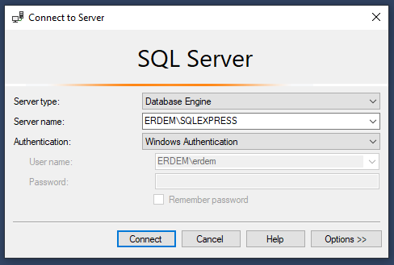
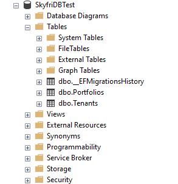
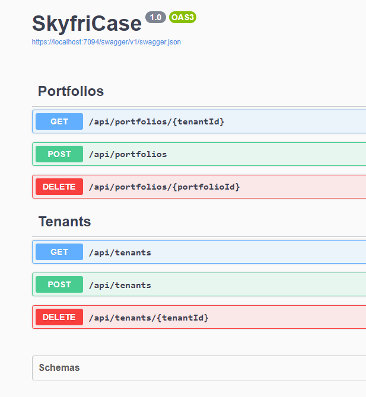
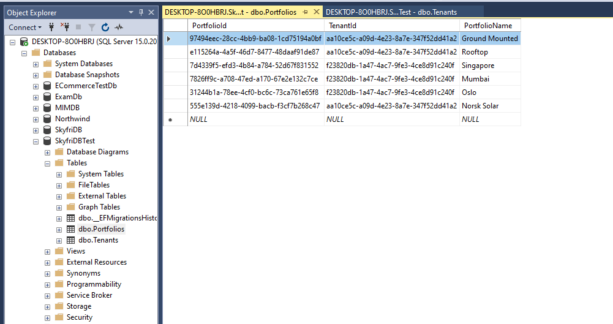
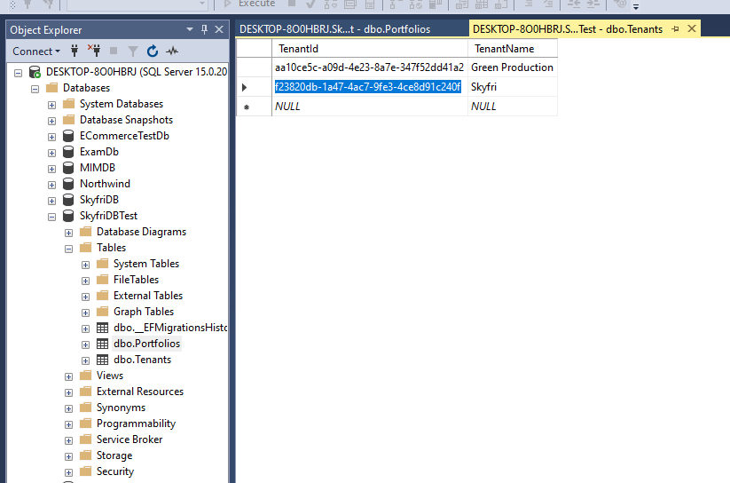
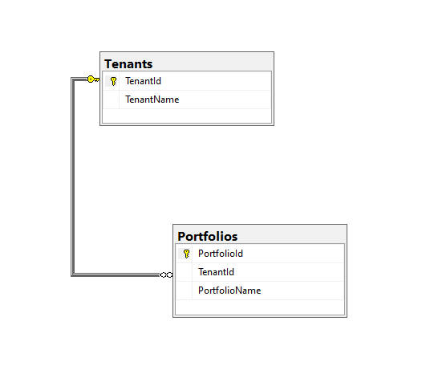


# Skyfri Coding Test

This project made for Skyfri Case to create an API to access a database with 2 tables, Tenants and Portfolio.

I decided to use Microsoft MSSQL for this project. 
I prefer not to keep the ConnectionString in a C# file, 
so I placed it in the `appsettings.json` file. 
In here, what you need to do is change the Server name in the `ConnectionString`
data to your own server name. This way, you will only have to make changes in one place.

To set up the database relationships in the Context folder, 
I placed the Entities and added two constructors. I also left the Migration 
file within this Solution, so the only thing you will need to do is update the database. 
To update the database, I am giving you two options. 

The first is to use the Package Manager Console and type `update-database`, 
or use PowerShell, making sure that your Path is within the solution, 
and type `dotnet ef database update`. I created the `DesignTimeDbContextFactory`
class to avoid errors when updating the database through PowerShell.

To retrieve the connection string from the appsettings.json file, 
I created the Configuration.cs class. Here, I used two nuget packages 
from Microsoft called `Extensions.Configuration` and `Extension.Configuration.Json`. 
Then, I added the code builder to the `Program.cs` file to set up the database context relationship, 
making the `Configuration` class static.

```sh
builder.Services.AddDbContext<SkyfriDbContext>(options=>options.UseSqlServer(Configuration.ConnectionString));
```


## API Reference

### PortfoliosController

| Method    | Path     | Description                |
| :-------- | :------- | :------------------------- |
| `GET`     | `api/portfolios/{tenantId}` | Retrieves all portfolios for the specified tenant. Returns a `404 Not Found` if the tenant does not exist. |
| `POST`    | `api/portfolios` | Adds a new portfolio to the specified tenant. Returns a `404 Not Found` if the tenant does not exist. |
| `DELETE`  | `api/portfolios/{portfolioId}` | Deletes the specified portfolio. Returns a `404 Not Found` if the portfolio does not exist. |

### TenantsController

| Method    | Path     | Description                |
| :-------- | :------- | :------------------------- |
| `GET`     | `api/tenants/` | Retrieves all tenants. |
| `POST`    | `api/tenants` | Adds a new tenant. |
| `DELETE`  | `api/tenants/{tenantId}` | Deletes the specified tenant. Returns a `404 Not Found` if the tenant does not exist. |


## Installation

* Clone this repository [here](https://github.com/AkarErdem/SkyfriCodingTest).
* Download the MSSQL from [here](https://www.microsoft.com/en/sql-server/sql-server-downloads).
* You would also need SQL Server Management Studio (SSMS), download from [here](https://learn.microsoft.com/en-us/sql/ssms/download-sql-server-management-studio-ssms-19?view=sql-server-ver16).
* Install/update all packages from NuGet:

```bash
- EntityFrameworkCore
- EntityFrameworkCore.Design
- EntityFrameworkCore.Tools
- EntityFrameworkCore.SqlServer
- Extensions.Configuration
- Extensions.Configuration.Json
- Swashbuckle.AspNetCore
```
* Open the SMSS and connect to the Server. 



* You can use your locally installed DB. Please note that Server name is important and will be used on the deployement.
* Do configure to your choice in the `appsettings.json` file.

> Important Note: If you are using Visual Studio 2022,
> you must update the latest version of EntityFrameworkCore from Nuget Packages.
> Also don't forget to use the .NET Version 7.
## Deployment

We have total of 3 steps to deploy this project.

### Step 1 
Edit the `ConnectionStrings` on the `Configuration.cs`.
```sh
"MSSQL": "Server=Erdem\\SQLEXPRESS;Database=SkyfriDB;trusted_connection=true;Encrypt=false"
```
Change `Erdem\\SQLEXPRESS` to your Server name. 

### Step 2
On the Package Manager Console, run;
```bash
  Update-Database
```

This command will create a new database, as shown below 

 
> 📝 Note that if you have changes on your scripts, you can use `Add-Migration [YourMigrationFileName]` command to add a new migration.

### Step 3
You can make API calls using Swagger. 
Run the project from Visual Studio and go to the localhost link on the browser.
`https://localhost:7094/swagger/index.html`


# Screenshots from project

## Portfolios Table



## Tenants Table



## Relation Diagram


